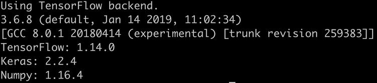

This repository is based on the code https://github.com/unnati-xyz/music-generation


[](https://travis-ci.org/DigitalDieter/music-generation)

# music-generation

Algorithmic music generation using Recurrent Neural Networks (RNNs,)
The underlying model is a Many-to-Many Long Short Term Memory  (LSTM) with a TimeDistributed Layer.

##### Addded the following features /  little imporvments to the project:

- Every new generated song will be auto incremented saved. No more editing of the generated song in the generation scipt needed

- Extended the train scripts mit arguments
-n num iters
-e epochs per iter
-b batch size


- ability to retrain the model on a specific a specific weights file

- ability to select a specific weights file for generating the song
Code restructure added wights and gen_songs folder
- Plotting and Saving loss for each training as picture in the weigts path

- re_train.py add to retrain the modle 

## Installation / Dependencies

You need to install the following packages as dependencies. For more information visit the project websites

- LAME is a high quality MPEG Audio Layer III (MP3) encoder licensed under the LGPL [website][f25fc56f]
- SoX - Sound eXchange, the Swiss Army knife of sound processing programs [website][43594682]

  [f25fc56f]: http://lame.sourceforge.net "lame-website"
  [43594682]: http://sox.sourceforge.net "sox-website"


Linux
```bash
apt install -y lame sox
```
MacOS
```bash
brew install lame
brew install sox
```


The other dependencies are added to the requirements.txt file

The rest of the dependencies can be installed with one of the two commands below.

```
pip install -r requirements.txt
# or
python -m pip install -r requirements.txt
```

and *SciPy* for various mathematical computation on tensors.
3. *Matplotlib* for visualizing the input.

### Step 1: Check system setup

Execute the following command in your command line:
Your output should loke similar like the one below.

```bash
python check_system_setup.py

```



### Step 2: Converting mp3 files
#into np tensors

Type the following command into the terminal:

``python convert_directory.py``


Converts mp3 --> mono files --> WAV file --> Numpy Tensors

Numpy Tensors INPUT for our LSTM  model.

The "np_array_x.npy" contains the input sequence for training
And the "np_array_y.npy contains the same sequence but shifted by one block


### Step 3: Training the model

You can change the number of Iterations,
Epochs per iteration and batch size by adjusting the following parameters:

- n = Number of Iterations (default=5)
- e = Epochs per iteration (default=3)
- b = Batch Size (default=5) , higher Bach Size speeds up training but uses more Memory

To train your model type he following command into the terminal.
The next arguments  added for an easier adjusting of the model.

### LSTM
For training the model, execute the train.py as described below:

```bash
python train.py -n 10 -e 5 -b 10
```
The model now can be retrained you have to selected the weights file from which the training of the model continues.
```bash
python re_train.py
```


### GRU
For training the model, execute the train_gru.py as described below:

```bash
python train_gru.py -n 10 -e 5 -b 10
```

The model now can be retrained you have to selected the weights file from which the training of the model continues.
You can add the same arguments as the train.py script.
The re_train.py script contains the same default as the normal train.script

```bash
python re_train_gru.py
```


An LSTM model was build that generates a sequence of notes which is
compared against the expected output and the errors are back-propagated, thus adjusting the parameters learned by the LSTM.

## Step 4: Generating the music

Now that you've finished training the model, its time to generate some music:)
Type the following command in your terminal':

``python generate.py``

After executing the generation, you have to select the Numpy weights file from which the audio sequence is generated (use arrow keys for selecting)

The generated WAV file saved in the directory gen_songs/generated_song.wav
