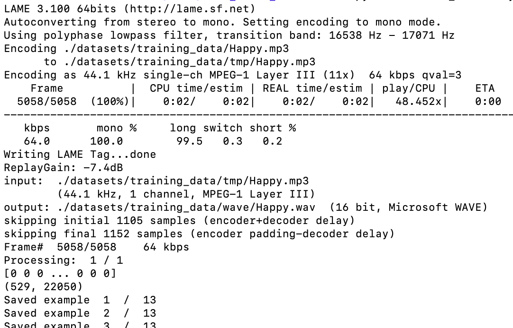
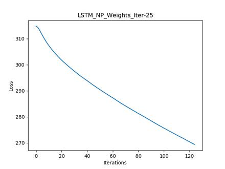
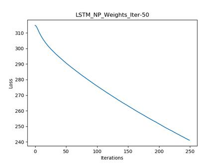

[](https://travis-ci.org/DigitalDieter/LSTM_Music_Generation)

# LSTM music-generation

In this project, I used Recurrent Neural Networks (RNNs) to generate music algorithmically. To get it to work, I converted old, Theano-based code from https://github.com/unnati-xyz/music-generation to use Python 3.7 and Tensorflow 1.14.0.

The underlying Keras 2.2.4 model is a Many-to-Many Long Short Term Memory (LSTM) with a TimeDistributed Layer. It uses .wav  as an input and generates Numpy Tensor as an output. I trained it for ZZZZ on a QQQQ machine.


The original code was using Python 3.5, Keras version 0.1.0 and the Theano backend.
The code was modifiyed to use TensorFlow 1.14.0 and Keras 2.2.4 on Python 3.7.3

##### Addded the following features /  little imporvments to the project:

- Every new generated song will be auto incremented saved. No more editing of the generated song in the generation scipt needed

- Extension of the training script with "argparse" parameters for easier handling
- Function extension to retrain the model to a specific weight file.
- Function extension to generate the song with specific weight file.
- Code restructure that save the outputs to own folders
- Plotting and saving the loss for each training as a picture in the weight's path
- re_train.py add to retrain the modle
- GRU model added

## Installation / Dependencies

You need to install the following packages as dependencies. For more information visit the project websites

- LAME is a high quality MPEG Audio Layer III (MP3) encoder licensed under the LGPL [website][f25fc56f]
- SoX - Sound eXchange, the Swiss Army knife of sound processing programs [website][43594682]

  [f25fc56f]: http://lame.sourceforge.net "lame-website"
  [43594682]: http://sox.sourceforge.net "sox-website"


Linux
```bash
apt install -y lame sox
```
MacOS
```bash
brew install lame
brew install sox
```

The other dependencies are added to the requirements.txt file and can be installed with one of the two commands below.


```bash
pip install -r requirements.txt
# or
python -m pip install -r requirements.txt
```

Build TensorFlow binary from scratch: Your CPU supports instructions that this TensorFlow binary was not compiled to use: AVX2 FMA
```bash
# Dependencies
sudo apt install -y pkg-config zip g++ zlib1g-dev unzip python3

# Dowmöpad bazel installer script
wget https://github.com/bazelbuild/bazel/releases/download/0.26.1/bazel-0.26.1-installer-linux-x86_64.sh

# Make it executeale
chmod +x bazel-0.26.1-installer-linux-x86_64.sh

# Run the script with --user flag
./bazel-0.26.1-installer-linux-x86_64.sh --user

# Export path
export PATH="$PATH:$HOME/bin"

# Install openjdk-11-jdk
sudo apt update && apt install -y openjdk-11-jdk

# Add bazel to repository
echo "deb [arch=amd64] https://storage.googleapis.com/bazel-apt stable jdk1.8" | sudo tee /etc/apt/sources.list.d/bazel.list
curl https://bazel.build/bazel-release.pub.gpg | sudo apt-key add -

# Install bazel
sudo apt update && apt install bazel

#Git clone tensorflow
git clone https://github.com/tensorflow/tensorflow.git

# Change directory
cd tensorflow

# Conigure the build
./configure

# Build tensorflow libtensorflow with bazel
bazel build --config=monolithic //tensorflow/tools/lib_package:libtensorflow

bazel build -c opt --copt=-march=native --copt=-mfpmath=both --config=cuda -k //tensorflow/tools/pip_package:build_pip_package

bazel build -c opt --copt=-march=native //tensorflow/tools/pip_package:build_pip_package

bazel build --config=opt --config=cuda //tensorflow/tools/pip_package:build_pip_package


gcc: error: unrecognized argument in option '-mfpmath=bothu'


INFO: From Compiling external/snappy/snappy.cc:
cc1plus: warning: command line option '-Wno-implicit-function-declaration' is valid for C/ObjC but not for C++
Target //tensorflow/tools/lib_package:libtensorflow up-to-date:
  bazel-bin/tensorflow/tools/lib_package/libtensorflow.tar.gz
INFO: Elapsed time: 19606.827s, Critical Path: 1330.70s
INFO: 6080 processes: 6080 local.
INFO: Build completed successfully, 6115 total actions

cp bazel-bin/tensorflow/libtensorflow.so ~/myproject/node_modules/@tensorflow/tfjs-node/build/Release/

cp /home/michel/coding/tensorflow/bazel-bin/tensorflow/libtensorflow.so.1.14.0

```


### Step 1: Check system setup

Execute the following command in your command line:
Your output should loke similar like the one below.


```bash
python check_system_setup.py

```


### Step 2: Converting mp3 files


Type the following command into the terminal:

```bash
python convert_directory.py
```




Trouble shooting: if you get this error:

``line 136, in convert_sample_blocks_to_np_audio
    song_np = np.concatenate(blocks)
ValueError: need at least one array to concatenate`line``

install lame sox


### Step 3: Training the model

You can change the number of Iterations,
Epochs per iteration and batch size by adjusting the following parameters:

- n = Number of Iterations (default=5)
- e = Epochs per iteration (default=3)
- b = Batch Size (default=5) , higher Bach Size speeds up training but uses more Memory

### LSTM
Long Short Term Memory

For training the LSTM model, execute the train.py as described below:

```bash
python train.py -n 10 -e 5 -b 10
```


The model now can be retrained, you have to selected the weights file from which the training of the model continues.
```bash
python re_train.py
```


After executing the re_train script, you have to select the Numpy weights file which is used as input for retraining (use arrow keys for selecting)


# Visualized LSTM model


An LSTM model was build that generates a sequence of notes which is
compared against the expected output and the errors are back-propagated, thus adjusting the parameters learned by the LSTM.

### GRU
Gated Recurrent Unit

For training the GRU model, execute the train_gru.py as described below:

```bash
python train_gru.py -n 10 -e 5 -b 10
```

The model now can be retrained, you have to selected the weights file from which the training of the model continues.


You can add the same arguments as the train.py script.
The re_train.py script contains the same default as the normal train.script

```bash
python re_train_gru.py
```


After executing the re_train script, you have to select the Numpy weights file which is used as input for retraining (use arrow keys for selecting)

# Visualized GRU model


An GRU model was build that generates a sequence of notes which is
compared against the expected output and the errors are back-propagated, thus adjusting the parameters learned by the GRU.

## Step 4: Generating the music

Now that you've finished training the model, its time to generate some music:)
Type the following command in your terminal':

```bash
python generate.py
```


After executing the generation, you have to select the Numpy weights file from which the audio sequence is generated (use arrow keys for selecting)

The generated WAV files saved in the directory gen_songs/generated_song1.wav

# Visualized generated songs

WAV Plots of the generated songs after specific number of iterations:

loss & generated_song after 10 iterations

| | 
|:---:|:---:|

loss & generated_song after 25 iterations

| | 
|:---:|:---:|

loss & generated_song after 50 iterations

| | 
|:---:|:---:|

loss & generated_song after 100 iterations

| | 
|:---:|:---:|


Generated song after 200 iterations


The increased number of the iterations improves the result but also increase the time of training the model.
